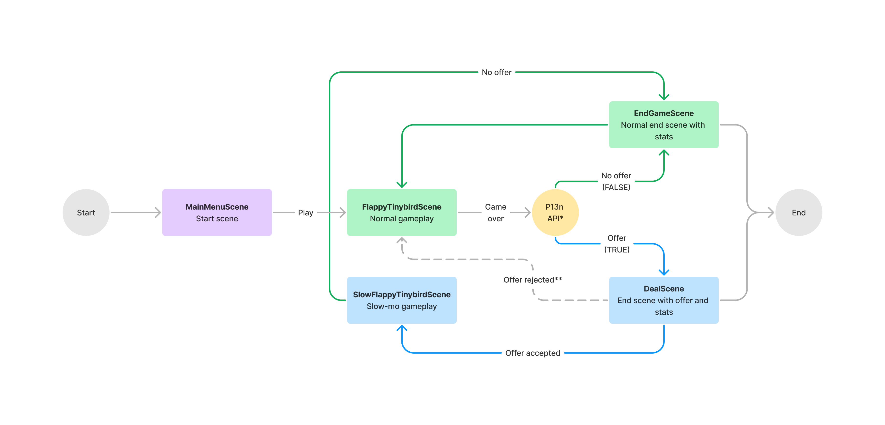

<p>
  <a href="https://www.tinybird.co/join-our-slack-community"></a>
</p>

#  Flappy Tinybird Workshop

Welcome to the Flappy Tinybird Workshop! The purpose of this workshop is to demonstrate the power of real-time analytics in gaming by revamping the analytical backend of the popular game, Flappy Bird.

You will build 2 real-time analytics use cases:
1. **User-facing analytics** to improve the gamer experience.

2. **Real-time personalization** to drive the monetization strategy in the game.

This repository contains a clone of Flappy Bird. It was built using the Phaser 3 game framework, JavaScript, and [Tinybird](https://www.tinybird.co/).

## Play the game!

Test your skills by playing 🎮🐥 [Flappy Tinybird](https://confluent-flappy.tinybird.app/)!

The goal of the game is to maneuver the bird through a challenging array of pipes, avoiding any collisions. The bird propels itself forward automatically, and the player controls its flight by either pressing the space bar or clicking on the screen to flap its wings. If you collide with a pipe, the ground, or the sky, it's game over!

## Create your Tinybird Workspace

To build real-time analytics into the game, you'll need to set up a Tinybird Workspace. Follow these steps:
1. Click [this link](https://ui.us-east.tinybird.co/workspaces/new?name=gaming_workshop) to create a Tinybird Workspace.

2. If prompted, log in or create a Tinybird account.

3. Give your Workspace a unique name.

4. Under **Starter kit**, select `None - Empty Workspace`.

5. Click **Create Workspace**.

Your Tinybird Workspace is set up and ready for action!

## Connect to Confluent

Next, you will connect to Confluent Cloud to ingest data from an existing Kafka topic and load it into Tinybird.
1. Click the **+** icon next to the Data Project section on the left navigation menu, select **Data Source**, and click **Confluent** from the list of available Data Sources.

2. You will be prompted to enter the following details:  

| Field | Value |
| --- | --- |
| _Connection name_ | Enter a unique name for the Confluent Cloud connection in Tinybird (e.g. tb_confluent). |
| _Bootstrap Server_ | {Instructor will share} |
| _Key_ | {Instructor will share} |
| _Secret_ | {Instructor will share} |
| _Decode Avro messages with Schema Registry_ | Leave it unchecked, as this topic does not contain encoded Avro messages. |


3. Once you have entered the details, click **Next** to create the connection between Tinybird and Confluent Cloud.

4. You will see a list of the existing topics. Select `demo_flappy`.

5. Tinybird will create a default Group ID that specifies the name of the consumer group this Kafka consumer belongs to. **To ensure uniqueness, use `demo_flappy_{your name}`**. It must have the prefix `demo_flappy` to gain read permissions to the topic. Click **Next**.

7. Once you have chosen a topic, you can select the starting offset to consume from. Choose **Earliest** to consume all messages from the beginning of the topic. Click **Next**.

8. Tinybird will consume a sample of messages from the topic and display the schema. Click **...** in the column headers to adjust the schema as follows:
  ```
  `type` LowCardinality(String),
  `timestamp` DateTime64
  ```

> _Note_: When modifying the data types, you may get an alert that 'Some rows could end up in quarantine'. You can safely disregard it if you are certain about your changes.

8. Click on **Advanced Settings** > **Sorting Key** and select `name`.

9. Once you have adjusted the schema, rename the Data Source to `confluent_events` and click **Create Data Source**.

Tinybird will begin consuming messages from the Kafka topic and loading them into the Data Source. Take a moment to explore 🔎 the data.

## Build your API Endpoints

Now that data from Confluent is flowing into Tinybird, the next step is to develop over that data using SQL and publish API Endpoints. You do that in Pipes.

### User-facing analytics

For the first use case, you will build a user-facing analytics use case: an API that returns the top 10 scores 🏆 in a global leaderboard.

Click the **+** icon next to the Data Project section on the left navigation and select **Pipe**.
1. Rename the pipe to `api_leaderboard`.

2. In the first node (SQL editor), copy and paste this query:
```
SELECT name AS player_id, session_id FROM confluent_events WHERE type = 'score'
```

3. Run the query and rename the node to `filter_data`.

4. Scroll down to the new transformation node. Copy and paste this query:
```
SELECT player_id, session_id, count() AS score
FROM filter_data
GROUP BY player_id, session_id
ORDER BY score DESC
LIMIT 10
```

5. Run the query and rename the node to `aggregate`.

6. Once you have completed the query, click **Create API Endpoint** in the top right corner and select the `aggregate` node.

🎉 BOOM! 🎉 You just went from an existing Kafka topic to a production-ready API Endpoint in minutes.

Copy the URL from the sample usage section and paste it into a new tab to make an API request. Go back to Tinybird and check out the usage metrics (you may need to wait a second or refresh the page).

> _Note_: This query was split into two nodes to demonstrate the notebook-style UX of Pipes, designed to simplify and accelerate your development. You can decide if you’d like to use one or multiple nodes; the Pipe is still executed as a single query.

### Real-time personalization

For the second use case, you will build a real-time personalization use case: an API that determines whether or not a player receives an offer 💸 based on their performance.

Click the **+** icon next to the Data Project section on the left navigation and select **Pipe**.
1. Rename the pipe to `api_personalization`.

2. Since you’re already a Tinybird expert 🥇, try writing this query by yourself! The query should work like this:

In the _last hour_, if a player _played 3 or more games_, scored _less than or equal to 15 points_, and made _0 purchases_, **return 1** (player receives an offer because they are struggling). Else, **return 0** (player does not receive an offer).

3. Here are some tips:

- All queries in the UI are free, so explore your data! Create Playgrounds (on the left navigation) to avoid cluttering your Workspace with Pipes.  
- Split your logic into multiple nodes and follow the [5 rules of fast queries](https://www.tinybird.co/docs/guides/best-practices-for-faster-sql.html#the-5-rules-of-fast-queries).  
- Filter on a specific player name to start. Then, make it a dynamic filter with a [query parameter](https://www.tinybird.co/docs/query/query-parameters.html).  
- Use the `uniq()` function to mimic a distinct count.  
- Use the `countIf()` function to perform a count with a conditional.  
- If you need extra help, the answer can be found in `/tinybird/endpoints/api_personalization.pipe`.  

4. Once you have completed the query, publish the desired node as an API Endpoint.

🎉 Nice work! You developed another use case that can be used to drive the monetization strategy of the game.

Copy the URL from the sample usage section and paste it into a new tab to make an API request. Go back to Tinybird and check out the usage metrics (you may need to wait a second or refresh the page).

## Challenge: Optimize your API Endpoints

Both Pipes query the raw data from the `confluent_events` Data Source. This is not a problem with a few thousand rows, but as your data scales up to millions or billions of rows, query performance will likely suffer.

A powerful way to optimize your queries in Tinybird is through [Materialized Views](https://www.tinybird.co/docs/guides/materialized-views.html), which let you pre-aggregate and pre-filter large Data Sources incrementally, adding simple logic using SQL to produce a more relevant Data Source with significantly fewer rows.

Put simply, Materialized Views shift computational load from query time to ingestion time, so your endpoints stay blazing ⚡️ fast.

Check out the guide linked above and refactor your queries using Materialized Views. Here are some tips:

- A typical Materialized View 'flow' in Tinybird consists of 3 resources: (1) a Pipe to materialize data into (2) a target Data Source, and (3) a Pipe to query from that Data Source and publish as an API.
- You create Materialized Views the same way you create API Endpoints. But instead of clicking 'Create API Endpoint', try clicking on the arrow next to it.
- Avoid dynamic filters (like a time filter on the last hour) in the 'materializing Pipe'; they may not work as you expect because of the nature of Materialized Views in Tinybird.
- Data in Materialized Views exists in intermediate states. When _creating_ a Materialized View, you need to add the `-State()` modifier to aggregate functions (e.g. `countState()`). When querying _from_ the Materialized View, you need to reaggregate and merge the intermediate states with the `-Merge()` modifier. 
- If you need help, the answer can be found in `/tinybird/pipes/mat_player_stats.pipe`, `/tinybird/endpoints/api_leaderboard_mv.pipe`, and `/tinybird/endpoints/api_personalization_mv.pipe`

> _Note_: Materialized Views are often used to improve performance by reducing the size of a Data Source by an order of magnitude. In this workshop, the volume of data may not be great enough to make a significant difference in performance. See a detailed example [here](https://www.tinybird.co/docs/guides/materialized-views.html#creating-a-materialized-view-in-the-tinybird-ui).

## Workshop wrap-up

With only a few clicks, you connected to an existing Kafka topic and streamed data into Tinybird. And with just a few lines of SQL, you built user-facing analytics to improve the player experience and real-time personalization to drive revenue.

Explore the rest of this repository to see how the entire project fits together. Happy flapping!

---

## Game flow

The flow of the game is as follows:
1. A player begins a standard game.

2. When the player loses, the game makes an API request to Tinybird to determine if the player should receive a personalized offer.

3. If the player does not get an offer, they are directed to the standard end scene and can retry.

4. If the player does get an offer, they are directed to the "offer" end scene and can accept the offer and make the game easier.

5. When the player loses the "easier" game, they are directed to the standard end scene - they cannot receive multiple offers within a certain time range.



*API request to determine whether or not a player receives a personalized offer.

**For purposes of the workshop, the player must accept the offer.

### Credits

This game was built by [Joe Karlsson](https://github.com/JoeKarlsson), [Alasdair Brown](https://github.com/sdairs), [Joe Krawiec](https://github.com/simply-joe), [David Margulies](https://github.com/davidnmargulies), and [Rafa Moreno](https://github.com/rmorehig) based on the original game by Dong Nguyen.

### License

This project is licensed under the MIT License.
